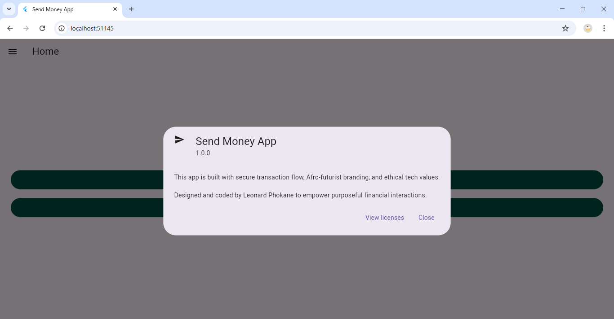
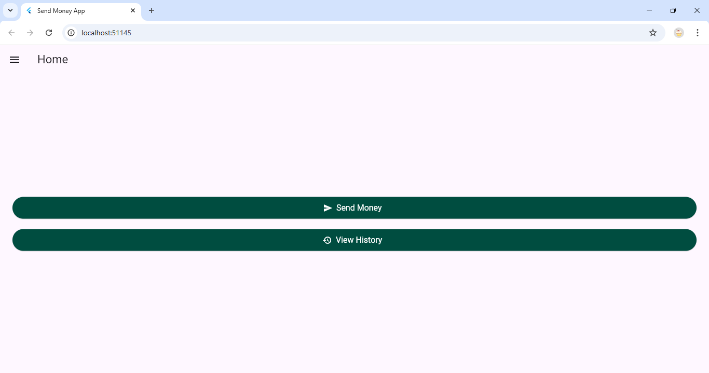
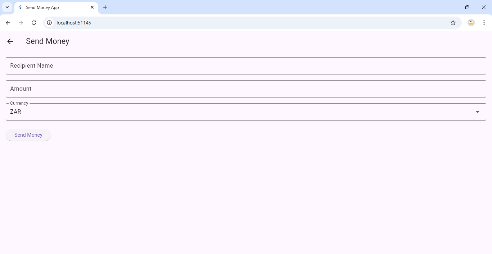
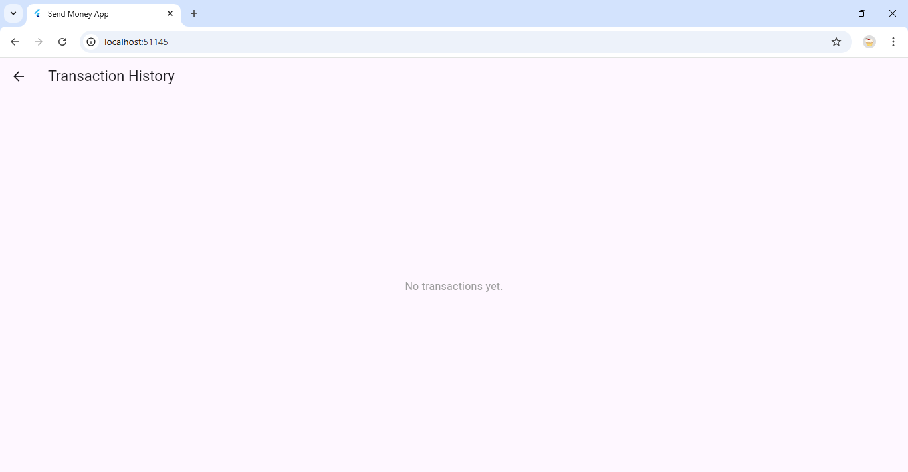
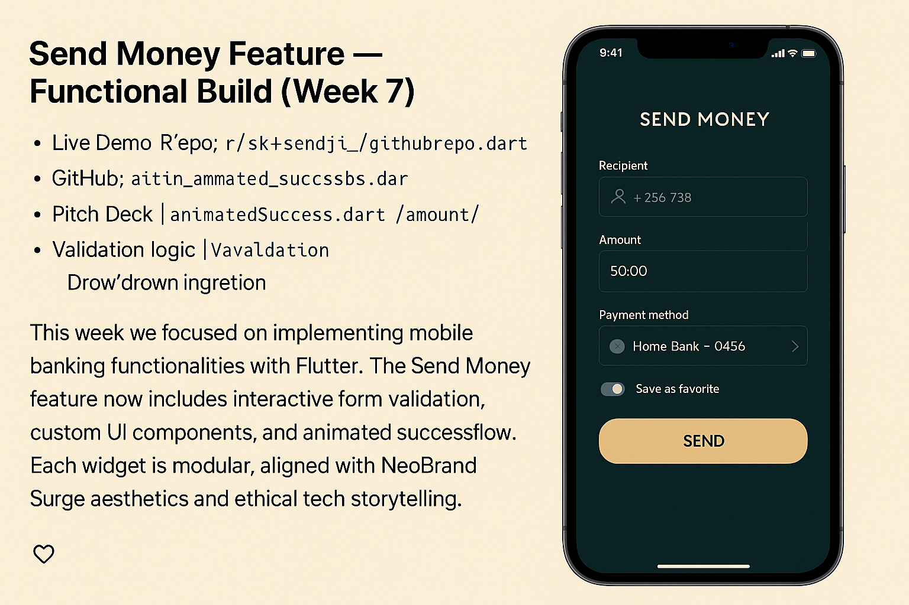
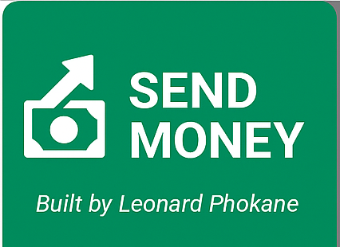
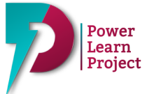
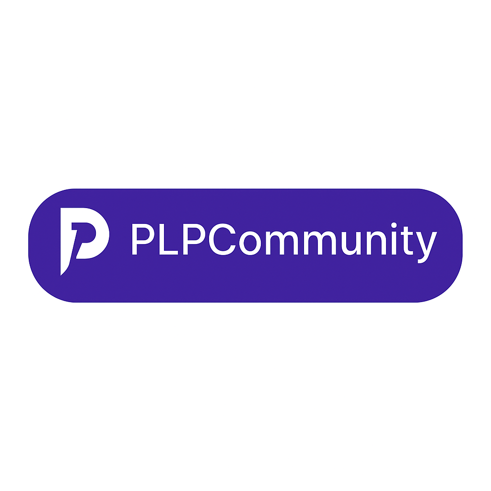

# 💼 Send Money App — Flutter Fintech Build (Week 8)


> “Transactions don’t just move money — they move stories.”  
> — Leonard Phokane

---

## 🚀 Overview

The **Send Money App** is a Flutter-powered fintech solution built for Dart Week 8 in partnership with PLPCommunity. It reflects Afro-futurist branding through ZuluTech, combines animated storytelling with ethical workflows, and enables secure, multi-platform transactions.

---

## ✅ Core Features

- 🧾 Recipient name + transaction amount input fields
- 🔽 Dropdown selection for payment method
- 💡 Favorite toggle switch for frequent transactions
- ⚠️ Form validation logic (empty/negative values)
- 💳 Reusable `SendButton` with branded UI
- 🌀 `AnimatedSuccess` confirmation overlay with auto-navigation
- 📋 Transaction history saved via SharedPreferences
- 🧭 Branded drawer with gradient background and logo integration
- 🖼️ Splash screen with smooth fade-in animations

---

## 🖼️ Visual Showcase

### 💸 Send Money UI Previews  
A curated look at the core screens within your Flutter fintech build:

| Screen                              | Preview |
|-------------------------------------|---------|
| **App Info Screen**                 | send_money_app_info_screen.png |
| **Home Dashboard**                  | send_money_app_home.png |
| **Currency Selection Interface**    | send_money_app_currency.png |
| **Transaction History Screen**      | send_money_app_history.png |
| **Main App View**                   | Send-money-app.png |
| **App Logo / Icon**                | app_logo.png |

> *Designed to reflect ZuluTech branding, modular architecture, and secure payment flow.*

---









---

## 📁 Folder Structure

lib/ ├── screens/ │ ├── home_screen.dart │ ├── send_money_screen.dart │ ├── transaction_history_screen.dart │ └── splash_screen.dart ├── widgets/ │ ├── send_button.dart │ └── dropdown_button.dart ├── models/ │ └── transaction_model.dart ├── utils/ │ ├── transaction_service.dart │ └── transaction_storage.dart └── main.dart


---

## 🔗 Project Links

- 🌍 Live Demo: [phokane-creative-code.lovable.app](https://phokane-creative-code.lovable.app)  
- 📊 Pitch Deck: [View on Canva](https://www.canva.com/design/DAGsxJEVKSg/ODdyq2DctbdY100QGlFy9w/edit)  
- 📦 GitHub Repo: [send-money-refined](https://github.com/leonardphokane/send-money-refined)  
- 🧭 Padlet Archive: [My Distinguished Padlet](https://padlet.com/plp9/my-distinguished-padlet-obiq9mj5yr6u1mxo)

---

## 🧠 Skills Applied

`Flutter Development` · `State Management` · `UI Animation` · `Custom Widgets`  
`Ethical Tech Audit Design` · `Brand Kit Integration` · `Multi-platform Deployment`

---

## 👤 About the Developer


Built by **Leonard Phokane** — a storyteller who codes with soul and structures with legacy.

- 💼 LinkedIn: [linkedin.com/in/leonardphokane](https://linkedin.com/in/leonardphokane)  
- 📦 GitHub: [github.com/leonardphokane](https://github.com/leonardphokane)  
- 🌍 Portfolio: [phokane-creative-code.lovable.app](https://phokane-creative-code.lovable.app)  
- 💌 Email: `leonardphokane1@gmail.com`

---

### 🔰 PLPCommunity & Branding




> *Built in collaboration with PLPCommunity — rooted in cultural empowerment and ethical tech.*

---

## 📈 Roadmap (Post–Week 8)

| Feature                    | Description                                       | Status       |
|---------------------------|---------------------------------------------------|--------------|
| Responsive Layouts        | Adapt UI across devices (tablet, desktop)         | Planned      |
| Confetti Celebration      | Success screen with celebratory animation         | In Progress  |
| Fairness Audit Integration| Check equity using Fairness Inspector             | Conceptual   |
| Localization Support      | Enable multilingual interface                     | Researching  |

---

## 📋 Launch Instructions

```bash
flutter pub get
flutter run -d windows

🧪 Reflection
“From form validation to visual storytelling — this is where fintech meets purpose.” — Leonard Phokane